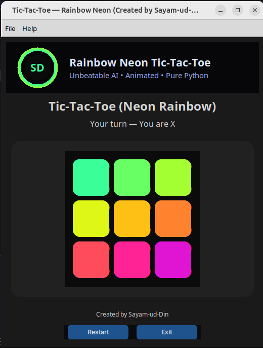

# 🌈 Rainbow Neon Tic-Tac-Toe

**Rainbow Gradient Neon Tic-Tac-Toe with Minimax AI** — Responsive, Animated, and Unbeatable!  

Created by **Sayam-ud-Din**  

  <!-- Optional: Add a screenshot -->

---

## Features

- 🟢 **Rainbow Neon Gradient** on all empty cells
- 🎨 **Responsive Board & Buttons** — perfectly scales with window size
- ⚡ **Winning Line Animation** — glows and pulses
- 🤖 **Unbeatable Minimax AI** — challenging for all players
- 🔥 **Click Animations** — neon click effects
- 🖥 **Resizable Window**
- 📝 **About Window** — info about the game
- 🖱 Restart & Exit buttons
- 🖤 **Dark / Neon Theme**

---

## Requirements

- Python 3.8+
- [customtkinter](https://github.com/TomSchimansky/CustomTkinter)
- tkinter (`python3-tk` on Ubuntu)

Install dependencies:

```bash
python3 -m venv venv
source venv/bin/activate
pip install customtkinter
sudo apt install python3-tk
